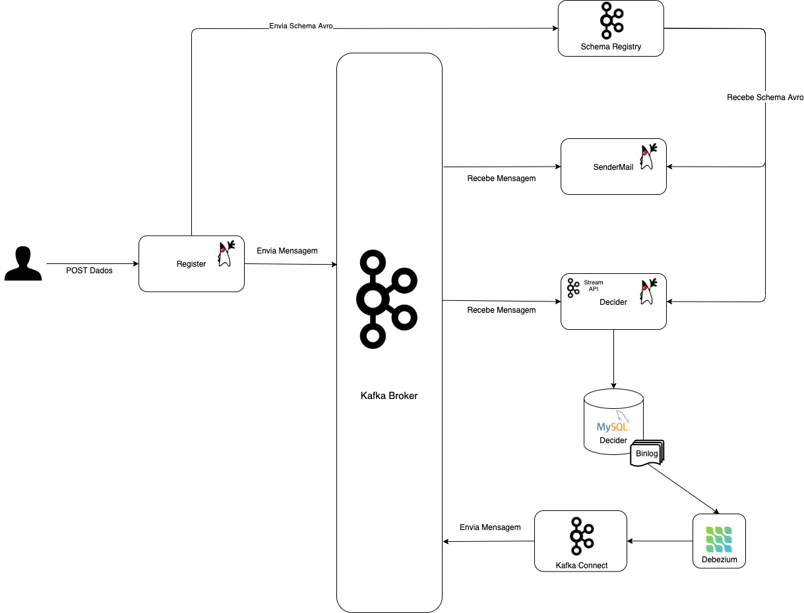

# Kafka Series (Em construção)

Repositório contendo os projetos usados nos artigos sobre Kafka do blog [programaDev](https://programadev.com.br/)

Artigos:

- [Produzindo mensagens com Kafka e Schema Registry](https://programadev.com.br/kafka-producer-avro/)
- [Consumindo mensagens do Kafka sem dor de cabeça](https://programadev.com.br/kafka-consumer/)
- [Kafka Streams com Java](https://programadev.com.br/kafka-streams/)

Diagrama:

